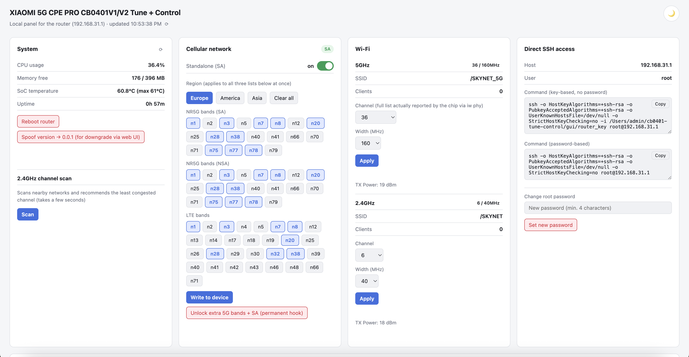
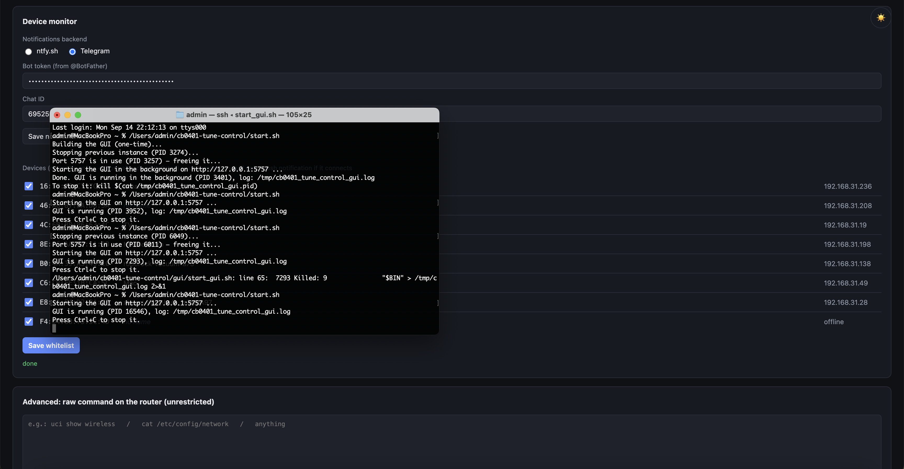

# CB0401 Tune + Control

A self-hosted setup script and web dashboard ("Xiaomi 5G CPE Pro Control") for the **Xiaomi 5G CPE Pro** router family — model **CB0401V2** (this project's own test device, sold under Deutsche Telekom's Magenta branding in Germany/Austria as the "Magenta Internet Box AX5400", used with any carrier SIM — the test device itself runs on an o2-DE SIM) and, very likely, the original **CB0401** (v1): both share the same Qualcomm IPQ5018 SoC and Quectel RG520N-family modem, and are listed under the identical "Xiaomi 5G CPE Pro" name in xmir-patcher's own device database — differing only in a modem firmware revision (R01 vs R03) that doesn't affect the AT-command surface this toolkit uses. Not independently verified on real CB0401 (v1) hardware, though.

For people who own the hardware and want to actually control it: persistent root SSH, a clean local admin panel for cellular/Wi-Fi settings that the stock UI doesn't expose, and **removal of the telemetry and junk cron jobs the stock firmware phones home with by default**.

Everything runs **locally** and is **fully self-contained** — no third-party exploit tool, no Python required for the core setup. The GUI is a single native binary bound to `127.0.0.1`, driven entirely by SSH commands to your own router. Nothing here talks to any third-party server except the router itself and, if you turn on push notifications, either [ntfy.sh](https://ntfy.sh) or the Telegram Bot API (your choice).



## What this actually does

Run once, `setup.sh` (macOS/Linux) or `setup.ps1` (Windows) will:

1. Open persistent root SSH on the router (`bootstrap/open_ssh.sh` / `.ps1`) — see [How SSH access is opened](#how-ssh-access-is-opened) below for exactly how and why this works. Skipped if SSH already works; falls back to a password-based key install if it doesn't apply. A dedicated SSH key for the toolkit is installed in the same step, so every later step (and the GUI itself) never needs your password again.
2. Set up push notifications and remote device-block commands: pick either a random, private [ntfy.sh](https://ntfy.sh) topic (zero setup) or a Telegram bot (needs a token + your chat ID), wire an instant new-device alert straight into dnsmasq (fires the moment a device gets a DHCP lease, no polling), and start a small listener on the router that lets you reply with commands like `trust`, `block` or `red alert` to react from your phone (a one-line cron watchdog keeps it running). Switchable later from the GUI's Device monitor card without re-running setup — see [Push notifications & remote commands](#push-notifications--remote-commands-optional).
3. Copy `router/cleanup.sh` onto the router and run it, removing telemetry uploads and dead cron jobs (see [What gets cleaned up](#what-gets-cleaned-up) below).
4. Build (if needed) and launch the GUI at `http://127.0.0.1:5757` — a single Go binary, nothing to install to run it.

Everything is idempotent — re-running the setup script is safe and just verifies/repairs each step.

Separately and entirely optionally, `./ruview.sh` turns the router into a Wi-Fi sensing source for [RuView](https://github.com/ruvnet/ruview)'s dashboard — see [RuView Wi-Fi sensing dashboard](#ruview-wi-fi-sensing-dashboard-optional). Nothing else depends on it, and `start.sh`/`setup.sh` never run it.

## How SSH access is opened

This isn't a novel exploit — it's documented Xiaomi router behavior that's been public knowledge in the router-hacking community for years. `bootstrap/open_ssh.sh`/`.ps1` try two paths automatically, in order:

**Path A — Telnet (firmware < 3.0.100, the common case):**

1. The router's web UI exposes an **unauthenticated** endpoint, `api/xqsystem/init_info`, which includes the device's serial number.
2. Xiaomi's own firmware-imaging tool (`mkxqimage`) derives a default root/Telnet password from that serial number: `md5(serial + "6d2df50a-250f-4a30-a5e6-d44fb0960aa0")`, first 8 hex characters. That salt is a hardcoded GUID with its segments reversed, found by reverse-engineering `mkxqimage` itself — not something this project invented.
3. Stock firmware ships with Telnet (port 23) always enabled, and root accepts that derived password.
4. The script logs in over Telnet and applies the same "soft" persistence patch used by xmir-patcher: enable dropbear (removing its release-build gate), set `nvram ssh_en=1`, install a cron job + firewall include hook that keep re-applying this every minute so it survives reboots, then install this toolkit's own SSH key directly.

**Path B — CVE-2023-26319 web exploit (firmware 3.0.100+, Telnet closed):**

Newer firmware closes Telnet, but the SmartController API has a command injection vulnerability: the `mac` field in `xqsmarthome/request_smartcontroller` is passed unsanitised into a 100-byte `sprintf()` → `system()` call. Injecting `;CMD;` runs CMD as root, up to ~20 characters per call. The bootstrap script:

1. Logs in to the web UI (same derived password, or set `WEB_PASSWORD=<password>` if you've changed it) to get a session token.
2. Writes a bootstrap script to `/tmp/e` on the router in 2-character chunks via repeated injection calls (`echo -n "XX">>/tmp/e`, three HTTP requests per chunk: `scene_setting`, `scene_start_by_crontab`, `scene_delete`).
3. Executes the script, which enables SSH and installs the toolkit's SSH key.
4. Installs persistence (ssh_patch.sh, cron job, firewall hook) via the now-open SSH connection.

This is the same mechanism [xmir-patcher](https://github.com/openwrt-xiaomi/xmir-patcher)'s `connect5.py` uses. The bootstrap script writes ~170 chunks (~510 HTTP requests), which takes roughly 3–5 minutes on a typical LAN connection.

**What the cron job and the firewall hook actually are.** Both paths leave two small pieces on the router, both pointing at one script, `/etc/crontabs/patches/ssh_patch.sh`. That script sets `nvram ssh_en=1`, removes the `"release"` check from `/etc/init.d/dropbear` so the SSH server is allowed to start on a retail build, then enables and restarts dropbear. It runs from a cron line (`*/1 * * * *`, every minute) and from a firewall include (`firewall.auto_ssh_patch`, which runs whenever the firewall reloads). The reason for two triggers is that the stock firmware can quietly turn SSH back off — after a reboot, or when it reapplies its own config — and either trigger notices and turns it back on. There's nothing else to configure: you never run or edit this by hand, and it only ever touches SSH.

**If both paths fail.** CVE-2023-26319 was patched in some firmware versions (the exploit is fully blocked when the router's `hackCheck` setting is 3). If both Telnet and the web exploit are refused, use [xmir-patcher](https://github.com/openwrt-xiaomi/xmir-patcher) once to open SSH, then run this toolkit as usual — everything after the first SSH connection only needs SSH. Because the toolkit's own key isn't installed yet in that case, `start.sh` will ask for the router's root password once.

## The GUI

A single-page dashboard covering:

- **System** — real-time CPU%, memory, SoC temperature, uptime, reboot button, a version-spoof button that lifts the stock updater's downgrade block (memory-only, reverts on reboot — see [Firmware downgrade & 5G band unlock](#firmware-downgrade--5g-band-unlock)), plus a 2.4GHz spectrum scan with a channel recommendation (scores every candidate channel by overlap-weighted, signal-weighted interference from every network your router can see, not just exact-channel matches).
- **Data Usage** — live cellular download/upload/total from the kernel's own interface counters (resets on reboot or modem reconnect).
- **Cellular** — 5G mode selector (`SA+NSA auto` / `Force SA only` / `NSA only` / `LTE only` — see [SA vs NSA](#sa-vs-nsa-5g) for what these actually mean and their real-world limits), region-based band presets (Europe/America/Asia, built from GSMA/3GPP allocation tables and, for Europe, this project's own factory-default bands), and raw band chips for full manual control via `AT+QNWPREFCFG`.
- **Wi-Fi** — 2.4GHz and 5GHz channel/width, live client count, read-only TX power display (see [Known hardware limitations](#known-hardware-limitations) for why it's read-only).
- **SSH** — one-click-copy commands for both key-based and password-based access, pre-filled with the `ssh-rsa` compatibility flags this router's old dropbear needs to work with a modern OpenSSH client, plus a field to change the router's root password (see [Changing the root password](#changing-the-root-password)).
- **Device monitor** — every device currently on your network, with a checkbox whitelist; unlisted devices trigger a push notification. A device with no DHCP hostname also gets a best-effort manufacturer name (from its MAC) and an mDNS-derived name if one answers — see [Identifying nameless devices](#identifying-nameless-devices). Also where you switch between ntfy.sh and Telegram, update your Telegram bot token/chat ID, or turn incoming-SMS forwarding on/off, at any time — see [Incoming SMS](#incoming-sms).
- **Advanced** — a raw SSH command box and a full `uci show` config dump, for anything the rest of the UI doesn't cover.



## SA vs NSA 5G

The Cellular card's 5G mode selector writes `AT+QNWPREFCFG="nr5g_disable_mode"` directly on the modem:

| Value | Mode | Effect |
|---|---|---|
| `0` | SA + NSA (auto) | Modem attaches to whatever the network offers — in practice, almost always NSA if the network offers both |
| `1` | NSA only | SA disabled |
| `2` | Force SA only | NSA disabled — the modem will only attach to a standalone 5G core network |
| `3` | LTE only | 5G disabled entirely |

**NSA (Non-Standalone) and SA (Standalone) are two different registration types, not two flavors of the same thing:**

- **NSA** anchors on an LTE cell for control-plane signaling and uses 5G NR purely as extra downlink/uplink capacity bolted on top. This is what almost every "5G" icon on a phone actually means today.
- **SA** is a fully independent 5G registration against a genuine 5G-only core network — no LTE involved at all.

Setting `Force SA only` doesn't manufacture SA coverage that isn't there — if your carrier hasn't deployed a real SA cell at your location, the modem falls all the way back to plain LTE (both NSA and SA unavailable), even if NSA 5G otherwise works fine there. Confirmed by direct `AT+QENG="servingcell"` queries on the project's own test connection (Telekom.de): with mode `0`, a working connection reports `"NR5G-NSA"`; forcing mode `2` on the exact same cell dropped straight to plain `"LTE"`, with zero NR bands active — proof there was no SA cell to fall onto, not a bug in this toolkit. Check your carrier's 5G SA rollout before assuming this mode should give you a 5G icon — NSA is what most "5G" networks actually run today.

`setup.sh`/`setup.ps1` build and launch [`gui/`](gui/) — a single native Go binary, nothing to install to *run* it (only to *build* it, once, if you don't use a prebuilt binary — see [`gui/README.md`](gui/README.md)).

## Push notifications & remote commands (optional)

The router will ping you the instant an unrecognized device joins your network — the alert is wired directly into dnsmasq's own `--dhcp-script` hook (`dhcp_notify.sh`), which fires exactly once per DHCP lease granted, not on a polling timer. There's no delay waiting for a periodic check, and nothing runs on the router in between actual connection events. You can reply directly from the notification, and the reply is handled just as fast: `command_watcher.sh` runs as a small always-on listener that keeps one long-polling request to Telegram (or an open ntfy stream) waiting, so a reply is acted on within about a second. The connection sits idle in between (about 1 MB of RAM, no polling), and a once-a-minute cron watchdog restarts the listener after a reboot. The new-device alert also makes sure it's running the moment it fires.

| Reply | Effect |
|---|---|
| `trust` | Adds the last unrecognized device seen to the whitelist, so it never alerts again (and lifts its block, if it had one) |
| `<MAC or IP> trust` | Same, for a specific device |
| `block` | Blocks the last unrecognized device seen |
| `<MAC or IP> block` | Blocks that specific device (resolves an IP to its current MAC first, and blocks by MAC — an IP-only block would stop protecting the device the moment its DHCP lease changes) |
| `red alert` | Locks Wi-Fi down to only the devices on your whitelist. This requires a full radio reload on this hardware, so it will briefly disconnect *every* device, including trusted ones — there's no way around that on this platform. |
| `all clear` | Removes the lockdown, back to normal |

You choose the delivery backend during setup (or later, from the GUI's Device monitor card — the change takes effect within a minute, no re-running setup or restarting anything):

- **ntfy.sh** — zero setup: just install the free [ntfy app](https://ntfy.sh) and a random topic name is generated for you. The topic *is* the access control — anyone who knows it can read your alerts and send these commands, so treat it like a password. Since it's a shared pub/sub topic, the router's own outgoing alerts also come back to it; `command_watcher.sh` filters those out by their exact notification title so they aren't mistaken for a command.
- **Telegram** — create a bot with [@BotFather](https://t.me/BotFather) (free, one-time) to get a bot token, then message your new bot once so it can see your chat ID. Commands are only ever accepted from that one chat ID, which is a tighter access model than a shared topic string — and since a bot never receives its own outgoing messages back, there's no self-message filtering needed on this path.

Either way, the credential (ntfy topic, or Telegram bot token + chat ID) is stored only in `gui/.env` on your machine and `/etc/crontabs/patches/notify.conf` on the router — both gitignored/generated locally, never part of this repository.

The first time you set a backend up (or whenever you switch it, or change the Telegram token/chat ID), you'll get a one-time welcome message through it listing the commands above — so you don't have to come back to this README to remember them once an actual alert shows up.

`device_monitor.sh` is still on the router alongside `dhcp_notify.sh`, but only runs once during setup — it scans whatever's already connected at that point so those devices are seeded as "already seen" instead of all alerting at once the moment the dnsmasq hook goes live. After that, it's unused unless you re-run setup (or run it manually over SSH, as a re-scan).

"Already seen" isn't forever, though: a device you haven't whitelisted (or blocked) gets re-alerted if it reconnects more than 4 hours after its last alert. The 4-hour window exists specifically so a router reboot - which makes every already-connected device request a fresh lease at once, since the lease file itself lives on `/tmp` and doesn't survive one - doesn't look like all of them just showed up for the first time; it isn't meant to mean "you've decided about this device, don't ask again" the way whitelisting or blocking it does.

## Incoming SMS

If the number this SIM is on ever gets a text (a carrier notice, a 2FA code, anything), it's forwarded to your ntfy/Telegram backend too — checked via the "Forward incoming SMS here too" checkbox next to the notification backend on the Device monitor card (on by default once you've set up a backend).

The stock firmware's own SMS handling (`/usr/sbin/mobile`) is compiled/encrypted Lua this project can't hook into or extend, so there's no equivalent of the dnsmasq hook above - `sms_notify.sh` polls instead, but cheaply: every 4 seconds it runs [`sms-reader`](router/sms-reader/) (a small, purpose-built, dependency-free Go program) against `/data/etc/mobile/xqSMS.db`, the small SQLite file that daemon already maintains. There's no `sqlite3` CLI on this router and installing one would mean either a multi-MB dependency or a foreign binary's libc against this firmware's userland - so `sms-reader` implements just enough of the SQLite file format to read new rows of that one known table, in a static binary built with `CGO_ENABLED=0` (no libc dependency of its own either). `setup.sh`/`setup.ps1` cross-build it for the router on the fly, the same way `start_gui.sh`/`.ps1` build the GUI itself - see [`router/sms-reader/build.sh`](router/sms-reader/build.sh) for the no-Go-installed fallback. See the program's own doc comment for the exact scope and what it deliberately doesn't try to handle (a table that's grown past a single b-tree page, essentially - not a realistic size for a personal SMS inbox).

Like the other listeners, `sms_notify.sh` runs under the same `--daemon`/`--ensure`/`--stop` convention with a once-a-minute cron watchdog, and a one-shot run at setup time seeds "already seen" from whatever's already in the database so it doesn't forward old messages the moment it goes live.

**Replying (Telegram only).** Reply directly to one of these forwarded "SMS from X" messages and your reply is sent back to X as a real text - quote-reply in Telegram, type your answer, done. This uses the stock firmware's own send path (`ubus call mobile sms '{"method":"send",...}'`, confirmed live to be a native, documented mechanism backed by `mobile_sms_send_message` over QMI to the modem, not an AT-command hack), so it works the same as texting from the phone this SIM would otherwise be in. `command_watcher.sh` matches the reply to the right number via a small `message_id → phone` map that `sms_notify.sh` writes when it forwards each SMS; it only applies to a real numeric sender, since an alphanumeric SMSC alias (e.g. a carrier's own "Telekom"-style sender ID) can't receive a reply at all. ntfy doesn't have an equivalent "reply to this specific message" concept, so this is Telegram-only.

## Identifying nameless devices

DHCP hostnames aren't always useful - some devices don't send one at all, and both iOS and Android now randomize their MAC address (and often the hostname with it) per network by default, specifically so a router can't reliably recognize or track them. When a device on the Device monitor card has no hostname, the GUI tries two more things, both best-effort and both run from the GUI itself (your own machine), not the router:

- **Manufacturer, from the MAC.** The first 3-4.5 bytes of most MAC addresses are an IEEE-assigned block identifying the manufacturer (embedded in the GUI binary - see [`gui/oui.go`](gui/oui.go) for where that data comes from). This is skipped entirely for a randomized address (checked via the address's own "locally administered" bit) - the address carries no real vendor info in that case, so even attempting a lookup would only ever produce a misleading coincidence, never a real answer.
- **A reverse mDNS query.** The GUI asks the local network directly ("does anyone know a name for this IP?", the same query `dns-sd -q <ip>.in-addr.arpa` or `avahi-resolve` would make) - see [`gui/mdns.go`](gui/mdns.go). Some devices still answer this even with a randomized DHCP identity; plenty don't, by design.

**On macOS**, this needs the "Local Network" permission - a plain command-line binary like this one doesn't get the usual permission popup for it, so if manufacturer/mDNS names aren't showing up, check System Settings → Privacy & Security → Local Network and enable it for the GUI binary, then restart the GUI. Windows/Linux don't have an equivalent gate.

## Wi-Fi channel capture, CFR (experimental)

The router's Qualcomm Wi-Fi chips can measure CFR (Channel Frequency Response, Qualcomm's name for CSI): how the radio channel to a connected device looks, per subcarrier, many times a second. That's the raw material for Wi-Fi presence and motion sensing. The stock firmware has everything in the kernel but ships no tool to switch it on; `router/` adds the missing pieces:

- `router/cfr-trigger` — a small static Go binary (`build.sh` cross-builds it) that talks nl80211 directly to arm or stop capture for one client, and with `-param` sets radio parameters Xiaomi's own tools can only read, such as the CFR periodic timer (`-iface wifi1 -param 0x1194 -value 1`) that periodic capture needs.
- `router/cfr_capture_daemon.sh` — keeps periodic capture running for one long-connected, awake client (configurable in `/etc/crontabs/patches/cfr_capture.conf`), with the stock `cfr_test_app` writing the results to `/tmp/cfr_dump_wifi*.bin`. Start it with `--ensure`, stop it with `--stop` (which also switches the timer off); it is not started automatically.
- `router/cfr-to-rvcsi` — converts those dump files on your computer; each tool's doc comment has the reverse-engineered record format.

Measured on the test router: up to ~46 captures per second per client at a 20 ms period (more at shorter periods). Nothing here is installed by `setup.sh`; `ruview.sh` (below) installs and uses it.

## RuView Wi-Fi sensing dashboard (optional)

The CB0401's Qualcomm radios can report CFR (Channel Frequency Response — per-subcarrier channel state, i.e. CSI) for any associated Wi-Fi client, and [RuView](https://github.com/ruvnet/ruview) is an open-source project that turns exactly that kind of data into presence/motion sensing with a live dashboard. `./ruview.sh` wires the two together, on demand:

```bash
./ruview.sh            # dashboard at http://localhost:3000, plus a Cloudflare quick tunnel and the link sent to your phone
./ruview.sh --local    # the same without the tunnel: nothing leaves this machine
```

What it does, every run, idempotently:

1. **Router side** — cross-builds `router/cfr-trigger` (an nl80211 vendor-command tool that arms CFR capture for one peer) and installs it together with `router/cfr_capture_daemon.sh`, which enables the firmware's CFR periodic timer (a setting Xiaomi's tools can read but not write; `cfr-trigger -param` sends it) and keeps periodic capture running every 20 ms for one awake client, preferring the one connected longest (a TV or desktop rather than a phone or a robot vacuum) — about 45–50 Hz, RuView's own per-node ceiling (measured live; the firmware can go up to ~245 Hz per client, and if you lower `PERIODICITY_MS` the bridge averages the excess down to 50 Hz for less noise instead of dropping it). Pin specific devices, restrict capture to one band or change the rate in `/etc/crontabs/patches/cfr_capture.conf` (`PEERS=`, `BAND=2.4|5|both`, `MAX_PEERS=`, `PERIODICITY_MS=`). A client in Wi-Fi power save (a smart bulb, for instance) only delivers captures in bursts with multi-second gaps, which RuView treats as offline; an always-awake device that stays put works best. Capture runs only while the script runs: it starts right before the bridge and stops, with the firmware timer switched off, when you quit. The captures land in the router's RAM, so if nothing collects them (the computer asleep or rebooted), the daemon keeps at most 16 MB and stops itself after a minute: an earlier version kept capturing with nobody collecting, filled the router's memory in about 8 minutes and made it reboot every ~13 minutes. Skip the install step with `--no-router-install`.
2. **RuView itself** — clones `github.com/ruvnet/ruview` into `./ruview/` (gitignored; it's a separate, much larger project, deliberately not vendored or forked here) and builds its `sensing-server` with `cargo`. The first build takes a while; later runs reuse it.
3. **The model** — downloads RuView's newest published pretrained bundle (`ruvnet/wifi-densepose-pretrained`, v2.0.1, plain HTTPS), converts it with `sensing-server --convert-model` into the `.rvf` container the server loads, keeps it in `data/models/` (gitignored) and starts the server with it loaded (`/api/v1/model/info` reports it). Honest caveat from RuView's own code: in this version no published weights actually drive live inference — pose and vitals stay signal-derived either way; the model mainly switches the dashboard into its "Model Inference" mode.
4. **The bridge** — `router/ruview-bridge` pulls every *finished* capture file off the router in one SSH round-trip (the file a reader is still writing is left for the next pass), drops empty records, keeps only the entries that actually carry the channel (measured on this hardware: 52 tones of the 20 MHz OFDM grid per receive chain, 4 chains on 5 GHz and 2 on 2.4 GHz; the rest of each capture buffer is noise), and replays the rest to `sensing-server` evenly over the time they were captured in, as RuView's own ESP32 raw-CSI UDP frames — so every captured client shows up in the **Sensing** tab as a node with its own variance/motion/presence readout. (RuView also has a Qualcomm frame format, `-format qcs1`, but its server only exposes that as a raw snapshot endpoint and never feeds it to the sensing pipeline.)
5. **Vital signs without an empty room** — upstream RuView publishes breathing and heart rate only after a 10-minute calibration on a *completely empty* room, and afterwards only while it counts exactly one person. A router by a window, with people outside and other people at home, can never satisfy that, so the numbers never appeared. `ruview.sh` therefore applies a small local patch to RuView's server (re-applied after every update, skipped with a note if upstream changes those lines): whenever someone is detected and quality gates pass (signal quality ≥ 0.40 as in RuView; rate confidence ≥ 0.35 instead of RuView's 0.55, since live estimates here sat at 0.38–0.50 with plausible values; `RUVIEW_VITALS_MIN_CONFIDENCE` overrides it). `/api/v1/vital-signs` also lists the candidate values and gates, so an empty readout says why, the rates are published and labelled `uncalibrated_estimate` in `/api/v1/vital-signs`. They are estimates, not medical data; with several people in range they can come from any of them. `RUVIEW_CALIBRATE=1` switches back to RuView's strict mode with an automatic, announced empty-room calibration every 11.5 hours.
The dashboard at `http://localhost:3000` is served through `router/ruview-proxy`, which puts RuView's HTTP API and its separate live WebSocket on one address. Without that, RuView's own **Observatory** page silently runs its demo generator.

6. **The public link** (skip with `--local`) — puts the dashboard behind `router/ruview-proxy` (RuView serves its UI and its live WebSocket on two different ports, a quick tunnel forwards one; the proxy also adds a per-run access key), opens a `cloudflared` quick tunnel to it, and sends the resulting `https://….trycloudflare.com/…?k=…` link through whatever `setup.sh` configured — your ntfy topic or Telegram bot — using the very same `notify()` the router's own alerts go through. The link lives exactly as long as the script runs. Needs `cloudflared` (`brew install cloudflared` on macOS).

The script stays in the foreground and stops everything on Ctrl+C. Logs land in `/tmp/ruview-*.log`.

**What to expect, honestly.** The selected client becomes a node streaming at roughly 45–50 Hz, more than enough for RuView's breathing (0.1–0.5 Hz) and heart-rate (0.67–2 Hz) band-passes. Presence, motion and signal strength are real measurements. Breathing and heart rate are uncalibrated estimates (see above). The skeletons RuView draws are procedural, not a measured pose: its published models don't run pose inference in the live path, whatever is loaded. A client in Wi-Fi power save yields no data, so the daemon prefers awake, long-connected devices. Extra prerequisites over the rest of this project: [Rust/cargo](https://rustup.rs), `python3` and `cloudflared` (not needed with `--local`).

## What gets cleaned up

By default (`sh cleanup.sh`, no flags), the following is disabled — all verified to have zero effect on routing, Wi-Fi, or cellular functionality:

- **`sp_check.sh`** — a cron job that gzips and uploads `web.log` / `rom.log` / `privacy.log` / `pri_rom.log` to a Xiaomi telemetry endpoint every 5 minutes.
- **`otapredownload`** — automatic firmware pre-download, which also has the side effect of silently overwriting any manual firmware/config changes you've made.
- **`breakpad`** — Google Breakpad crash reporter, uploads crash dumps to Xiaomi.
- A couple of dead cron entries left over from other hardware variants (referencing scripts and directories that don't even exist on this firmware).

Two extra, opt-in flags exist for things that are genuinely useful for *some* people and not others:

- `--disable-mesh` — disables `cab_meshd` / `miwifi-discovery` / `miwifi-roam`, which run at boot unconditionally even if you have no Xiaomi Mesh satellite node paired. Skip this if you actually use Mesh.
- `--disable-messagingagent` — disables the router's MQTT connection to Xiaomi's cloud. This may be what the Mi Home app or your carrier's remote support tooling relies on — only disable it if you don't need either.
- `--all` — both of the above.

Pass these to `setup.sh`/`setup.ps1` via the `CLEANUP_FLAGS` environment variable (e.g. `CLEANUP_FLAGS=--all ./setup.sh`) so you don't need a manual follow-up SSH session.

**On persistence:** service disables (`--disable-mesh`/`--disable-messagingagent`/breakpad) only take effect through `/etc/init.d/X disable`, which lives on this router's ramfs-mounted `/etc` — confirmed live that they silently revert to "enabled" after a reboot, the same root cause as the [root password not sticking without the direct-write fix](#changing-the-root-password). `cleanup.sh` works around this the same way `bootstrap/open_ssh.sh` keeps SSH open: it installs a small cron job that reapplies the disables within a minute of every boot. The telemetry/dead-cron removals above don't need this — they edit `/etc/crontabs/root`, which is a symlink into persistent storage and survives reboots on its own.

## Known hardware limitations

These were all confirmed through direct testing on real hardware this project was built against, not assumed from documentation:

- **TX power cannot be changed from software.** `iw set txpower fixed` returns success but has zero measurable effect; the vendor `cfg80211tool s_txpow` returns `EINVAL`; `get_maxpower`/`get_minpower` are unimplemented stubs. The GUI shows the real value read-only.
- **`qca_spectral`** is loaded and referenced by the driver stack, but exposes no usable userspace interface anywhere (checked `cfg80211tool`, `iwpriv`, and the full `debugfs` tree) — it appears to be purely an internal DFS radar-detection dependency, not something you can point at a spectrum analyzer.
- **No Docker/Entware/Node.js.** Persistent storage is a single ~20MB partition; there simply isn't room, and the vendor's `opkg` feed is dead (404).
- **A `wifi reload` briefly drops every client**, trusted or not. This is triggered by changing Wi-Fi channel/width and by the `red alert`/`all clear` commands — it's a platform limitation of this driver stack, not a bug in this toolkit.

## Changing the root password

`/etc/shadow` is a symlink into the router's tiny persistent partition, but it sits under a `ramfs`-mounted `/etc` — a password change made the usual way (`passwd`, or editing that path) gets lost on the next reboot. The GUI's "Change root password" button works around this by writing the new hash directly to `/data/etc/shadow` (the real persistent path the symlink points at) instead of going through `/etc/shadow` itself — confirmed live to survive a reboot, unlike the naive approach.

The GUI always logs in with its own SSH key first, and only falls back to a password (to silently reinstall the key) if the key stops working — for instance after a factory-reset-like event that wipes `/etc`. Whenever you change the password from the GUI, it updates the toolkit's own `.env` in the same step, so that fallback keeps using the current password rather than the stale factory one.

This password fallback needs the `sshpass` tool, which `setup.sh` installs for you on macOS/Linux. It isn't available on Windows by default, so on Windows this one specific fallback is a no-op — the GUI still works normally, and if the router ever does lose the key, just re-run `setup.ps1` to reinstall it.

## Getting started

### Prerequisites (both platforms)

- Your CB0401/CB0401V2 connected and reachable at its default gateway address, `192.168.31.1` (override with the `ROUTER_IP` environment variable if yours differs).
- An SSH client (`ssh`/`scp`) — already on macOS/Linux; on Windows, the built-in OpenSSH Client feature (present by default on Windows 10 1809+ and Windows 11; if `ssh` isn't recognized, enable it with `Add-WindowsCapability -Online -Name OpenSSH.Client~~~~0.0.1.0` from an admin PowerShell).
- [Go](https://go.dev/dl/) 1.21+, **only** if you want `setup.sh`/`setup.ps1` to build the GUI from source on first run (the default). If you'd rather not install Go, build `gui` on another machine (`gui/build.sh`) and drop the resulting binary into `gui/` before running setup — it'll be used as-is.

That's it — no Python and no xmir-patcher needed at all, for anything.

### macOS / Linux

```bash
git clone https://github.com/Kreal-exe/cb0401-tune-control
cd cb0401-tune-control
./start.sh
```

### Windows

```powershell
git clone https://github.com/Kreal-exe/cb0401-tune-control
cd cb0401-tune-control
powershell -ExecutionPolicy Bypass -File start.ps1
```

`start.sh`/`start.ps1` is the one command for everything, every time: it checks whether the SSH key already works against the router, and either runs the full `setup.sh`/`setup.ps1` (first run) or skips straight to launching the GUI (every run after that) — no need to remember which script to use.

The full setup opens SSH automatically (see [How SSH access is opened](#how-ssh-access-is-opened)); if that doesn't apply to your router, it asks for the router's SSH password exactly once, during the one-time key installation step — enter the derived default password from that section, or whatever you've since changed it to. Every step after that uses the key. It will also ask you to pick ntfy.sh or Telegram for notifications (see [Push notifications & remote commands](#push-notifications--remote-commands-optional)); for a non-interactive run, set `NOTIFY_BACKEND=telegram` plus `TELEGRAM_BOT_TOKEN`/`TELEGRAM_CHAT_ID` (or leave `NOTIFY_BACKEND` unset for ntfy) as environment variables beforehand.

Once setup finishes, the GUI opens automatically at `http://127.0.0.1:5757`.

### Firmware downgrade & 5G band unlock

Both live as one-click buttons in the GUI itself — no separate script, no xmir-patcher, since they only need the SSH access this toolkit already has:

- **System card → "Spoof version → 0.0.1"** — lifts the stock web updater's downgrade block (Settings > Update > Local update), if you need to flash an older firmware version. Memory-only (a bind-mount), reverts on its own at the next reboot.
- **Cellular card → "Unlock extra 5G bands + SA"** — installs a permanent hook (adapted from [davidohne/xiaomi_cb0401](https://github.com/davidohne/xiaomi_cb0401)) that reapplies your band selection and 5G mode (see [SA vs NSA](#sa-vs-nsa-5g)) on the cellular modem on every `wan_2` reconnect, including after a reboot — the stock firmware doesn't otherwise remember either setting across a reconnect. Seeded from whatever's already configured the first time you install it (n1/n3/n7/n28/n38/n75/n78 and SA+NSA auto by default if nothing's been set yet); from then on, changing bands or the 5G mode from the Cellular card keeps the hook in sync, so a reconnect never reverts you back to a stale value.

Both modify firmware/modem configuration and aren't covered by the same idempotency guarantees as the rest of this toolkit — read the button's confirmation prompt before clicking.

## Security notes

- This project modifies firmware behavior on a device that may be leased from, or branded by, your carrier. Check your terms of service; use at your own risk.
- Opening SSH relies on a default password derived from your router's serial number (see [How SSH access is opened](#how-ssh-access-is-opened)) — this is stock Xiaomi firmware behavior, not something this project introduces, but it does mean anyone on your LAN who can reach the router's web UI before you run setup could derive that password too. Run setup promptly after unboxing/resetting the device.
- The GUI has no authentication of its own — it relies entirely on binding to `127.0.0.1`. Do not expose port 5757 to your network.
- `./ruview.sh` deliberately *does* expose something (unless run with `--local`): RuView's dashboard, through a Cloudflare quick tunnel, i.e. via Cloudflare's servers. RuView's API is unauthenticated, so the only gate is the random per-run access key in the link you're sent — treat that link like the ntfy topic (anyone who has it is in), don't forward it, and remember it dies with the script. With `--local` nothing leaves your machine except SSH to the router.
- `gui/router_key`, `gui/router_key.pub`, and `gui/.env` (which holds the router's root password, plus your ntfy topic or Telegram bot token) are generated locally by setup and are gitignored — never commit or share them.
- SMS forwarding (see [Incoming SMS](#incoming-sms)) means anything sent to this SIM - including 2FA/login codes - ends up in your ntfy topic or Telegram chat too. Turn it off from the Device monitor card if that's not something you want going through a third-party push service.
- The SMS reply feature means anyone who can reply in that Telegram chat can send a real text from this SIM's number to whoever originally texted it. That's normally just you, but it's worth remembering if you ever add someone else to the chat or the bot token leaks - it's not just read access to your messages at that point, it's send access too.
- The mDNS lookup in [Identifying nameless devices](#identifying-nameless-devices) sends a query packet to whatever device is at each nameless IP - a normal, unauthenticated DNS-style question any device on your LAN could equally send, and nothing this project didn't already have (it already talks to every device's IP indirectly, e.g. to notice it on the network at all), but still real traffic leaving the GUI toward other devices, unlike everything else here which only ever talks to the router itself and your chosen notification backend.

## License

MIT — see [LICENSE](LICENSE).
